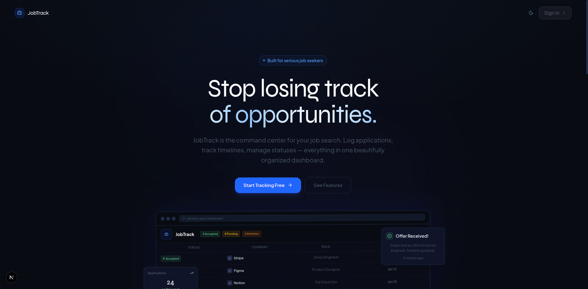

# JobTrack

The command center for your job search. Track every application, manage timelines, and never lose track of an opportunity again.


---

## Features

- **Application Tracking** — Log every job application with company, role, channel, apply type, date, links, and notes
- **Status Management** — Track applications across 6 statuses: Pending, Accepted, Rejected, Needs Attention, Expired, Disputed
- **Timeline per Application** — Add timeline entries for every stage (interviews, calls, offers, rejections) with auto-generated status change logs
- **Bulk Operations** — Select multiple applications and mark them as expired in one click
- **Bulk Add** — Add multiple applications at once via a collapsible accordion form
- **Edit Applications** — Update any application's details inline
- **Advanced Filtering** — Filter by status, channel, apply type, and date range simultaneously
- **Sorting** — Sort by applied date, company name, job title, or status
- **Pagination** — Choose 10, 20, or 50 rows per page
- **Full Data Table** — All 14 application fields visible as columns with tooltip previews and one-click copy
- **Google Sign-In** — Secure authentication via Firebase Auth
- **Dark Mode** — Full dark/light theme support

---

## Screenshots

### Dashboard


### Application Details & Timeline



### Add / Edit Application


---

## Tech Stack

- **Framework** — Next.js 15 (App Router)
- **Language** — TypeScript
- **Styling** — Tailwind CSS v4
- **UI Components** — Radix UI primitives + custom shadcn-style components
- **Backend** — Firebase Firestore (real-time subscriptions)
- **Auth** — Firebase Authentication (Google OAuth)
- **Icons** — Lucide React
- **Fonts** — Plus Jakarta Sans + Syne (Google Fonts)

---

## Getting Started

### Prerequisites

- Node.js 18+
- pnpm
- A Firebase project with Firestore and Google Auth enabled

### Setup

1. Clone the repository

```bash
git clone https://github.com/your-username/job-tracker.git
cd job-tracker
```

2. Install dependencies

```bash
pnpm install
```

3. Create a `.env` file at the root (see `env-example.md` for reference)

```env
NEXT_PUBLIC_FIREBASE_API_KEY=...
NEXT_PUBLIC_FIREBASE_AUTH_DOMAIN=...
NEXT_PUBLIC_FIREBASE_PROJECT_ID=...
NEXT_PUBLIC_FIREBASE_STORAGE_BUCKET=...
NEXT_PUBLIC_FIREBASE_MESSAGING_SENDER_ID=...
NEXT_PUBLIC_FIREBASE_APP_ID=...
```

4. Deploy Firestore security rules

```bash
firebase deploy --only firestore:rules
```

5. Create the required Firestore composite index (applications: `userId ASC, createdAt DESC`) — the app will show a direct link in the console on first run if it's missing.

6. Start the dev server

```bash
pnpm dev
```

Open [http://localhost:3000](http://localhost:3000).

---

## Firestore Structure

```
/users/{uid}
/applications/{applicationId}
  /timelines/{timelineId}
```

---

## Data Migration

A migration script is included to bulk-import applications from a CSV-style dataset:

```bash
node migrate.mjs <YOUR_FIREBASE_UID>
```

> Temporarily set Firestore rules to `allow read, write: if true;` before running, then restore them after.

---

## License

MIT
