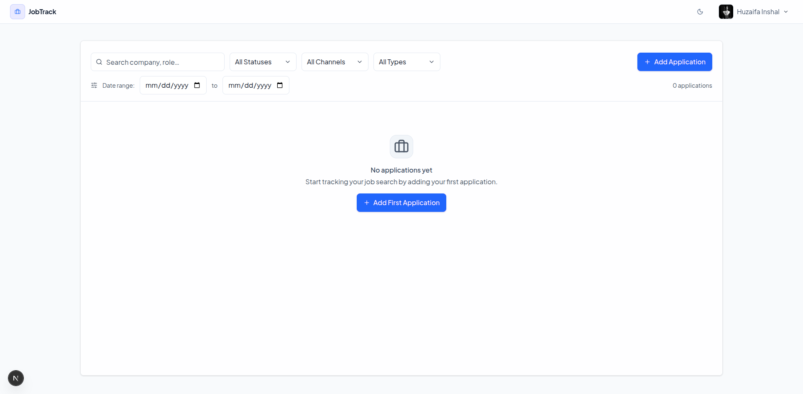
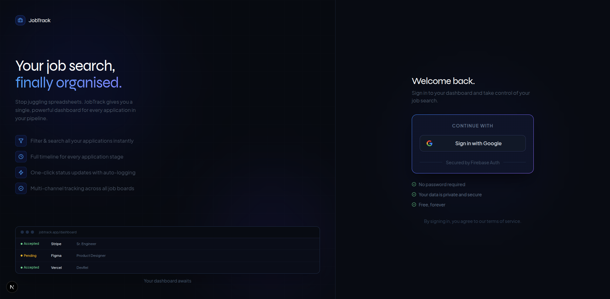

# JobTrack — Web Application



---

## Screenshots

### Dashboard


### Application Details & Timeline


### Add / Edit Application



---

## Tech Stack

- **Framework** — Next.js 15 (App Router)
- **Language** — TypeScript
- **Styling** — Tailwind CSS v4
- **UI Components** — Radix UI primitives + custom shadcn-style components
- **Backend** — Firebase Firestore (real-time subscriptions)
- **Auth** — Firebase Authentication (Google OAuth)
- **Icons** — Lucide React
- **Fonts** — Plus Jakarta Sans + Syne (Google Fonts)

---

## Getting Started

### Prerequisites

- Node.js 18+
- pnpm
- A Firebase project with Firestore and Google Auth enabled

### Setup

1. Navigate to the web application directory

```bash
cd "web application"
```

2. Install dependencies

```bash
pnpm install
```

3. Create a `.env` file at the root (see `env-example.md` for reference)

```env
NEXT_PUBLIC_FIREBASE_API_KEY=...
NEXT_PUBLIC_FIREBASE_AUTH_DOMAIN=...
NEXT_PUBLIC_FIREBASE_PROJECT_ID=...
NEXT_PUBLIC_FIREBASE_STORAGE_BUCKET=...
NEXT_PUBLIC_FIREBASE_MESSAGING_SENDER_ID=...
NEXT_PUBLIC_FIREBASE_APP_ID=...
```

4. Deploy Firestore security rules

```bash
firebase deploy --only firestore:rules
```

5. Create the required Firestore composite index (applications: `userId ASC, createdAt DESC`) — the app will show a direct link in the console on first run if it's missing.

6. Start the dev server

```bash
pnpm dev
```

Open [http://localhost:3000](http://localhost:3000).

---

## Firestore Structure

```
/users/{uid}
/applications/{applicationId}
  /timelines/{timelineId}
```

---

## Data Migration

A migration script is included to bulk-import applications from a CSV-style dataset:

```bash
node migrate.mjs <YOUR_FIREBASE_UID>
```

> Temporarily set Firestore rules to `allow read, write: if true;` before running, then restore them after.
